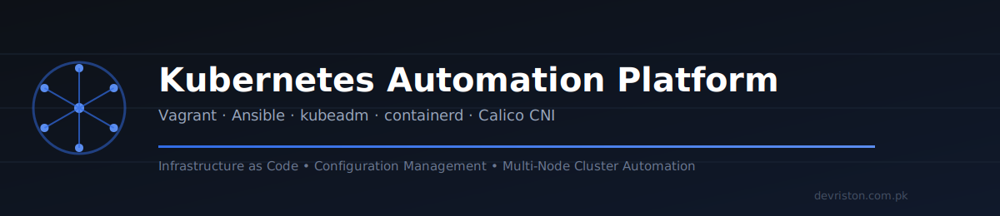
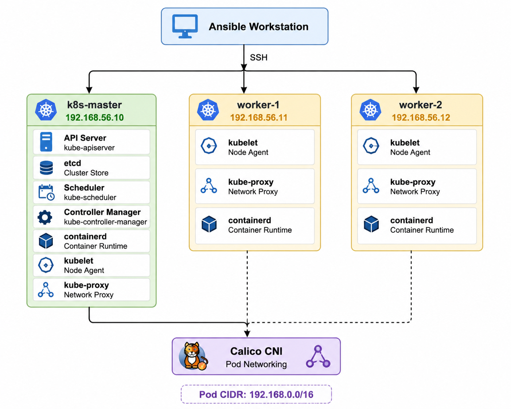
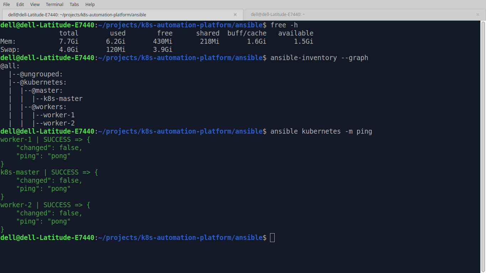
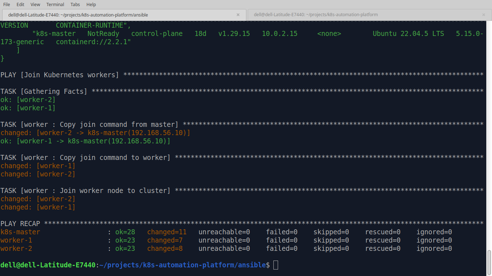
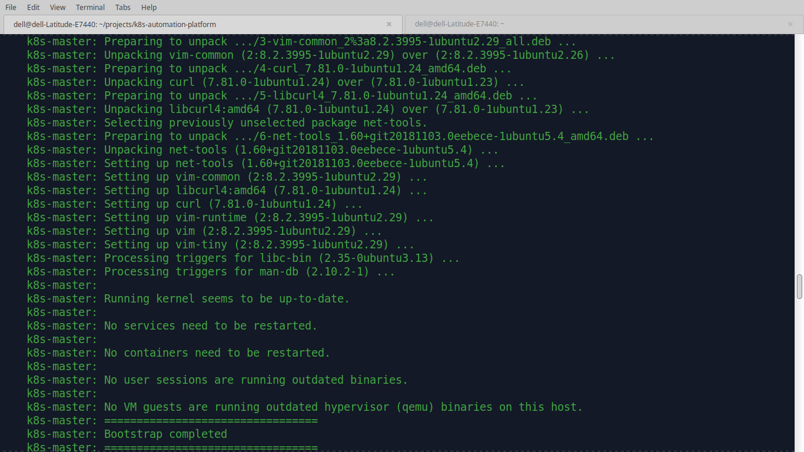
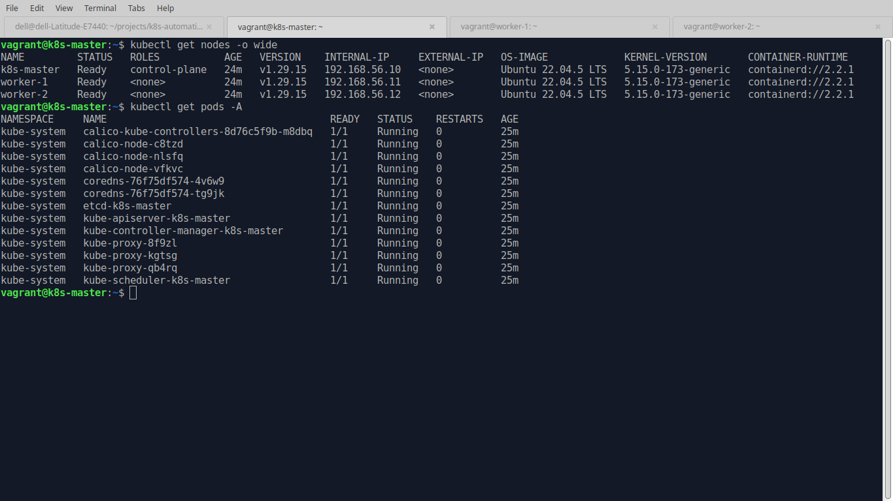
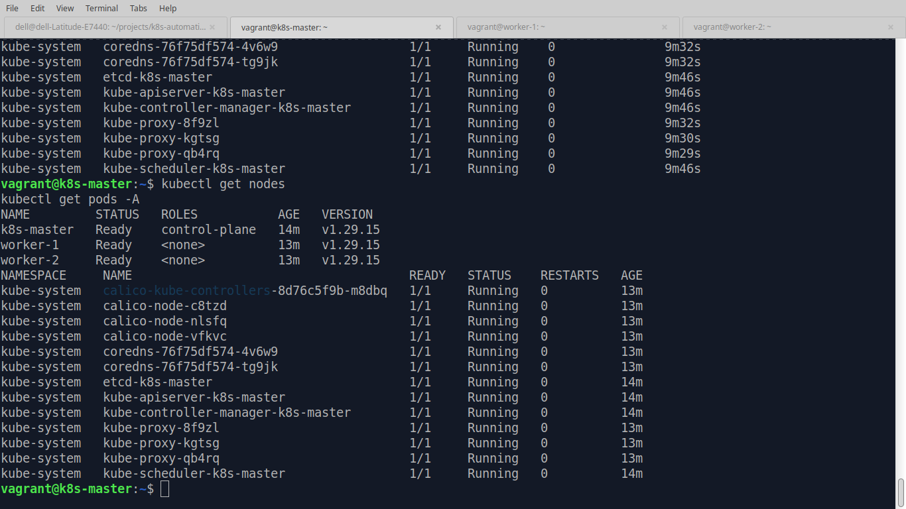
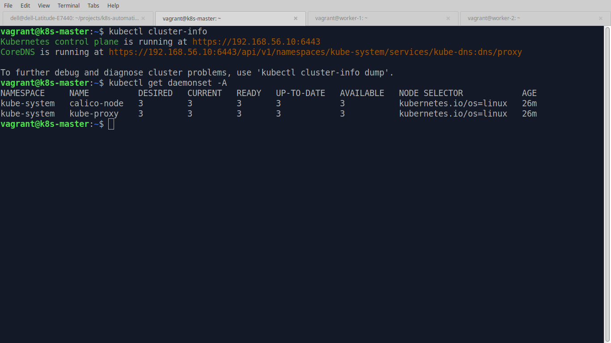
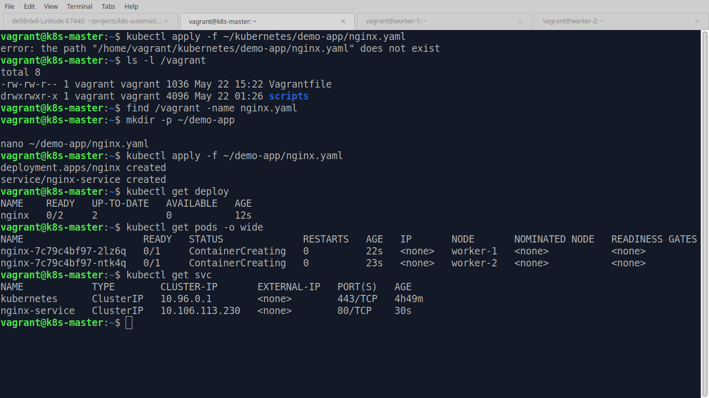

<p align="center">
  
</p>

<h1 align="center">☸️ Kubernetes Automation Platform</h1>

<p align="center">
  <strong>Production-style Kubernetes cluster automation using Vagrant, Ansible, kubeadm, containerd, and Calico.</strong>
</p>

<p align="center">
  Infrastructure as Code • Configuration Management • Cluster Automation • Kubernetes Fundamentals
</p>

<p align="center">
  
  
  
  
  
  
</p>

<p align="center">
  <a href="https://devriston.com.pk"></a>
  <a href="https://www.linkedin.com/in/kamrankabeer/"></a>
  <a href="https://github.com/muhammadkamrankabeer-oss"></a>
</p>

---

## 📌 Overview

Kubernetes clusters are often built manually during labs and learning exercises. This project demonstrates how a multi-node Kubernetes environment can be provisioned and configured entirely through automation.

The platform uses **Vagrant** to provision infrastructure and **Ansible** to automate cluster configuration, enabling repeatable and consistent deployments without manual Kubernetes installation steps.

The result is a fully functional Kubernetes cluster consisting of:

- 1 Control Plane node
- 2 Worker nodes
- containerd container runtime
- Calico CNI networking
- Automated worker node joining
- Automated cluster verification
- Sample application deployment

---

## 🎯 Project Objectives

This project was built to demonstrate:

- Infrastructure as Code (IaC)
- Configuration Management
- Kubernetes Cluster Bootstrapping
- Multi-node Cluster Networking
- Ansible Role-Based Architecture
- Linux System Administration
- DevOps Automation Practices
- Troubleshooting and Operational Skills

---

## 🚀 Key Features

**Infrastructure Provisioning**
- Automated VM creation using Vagrant
- Multi-node cluster topology
- Reproducible local Kubernetes lab

**Kubernetes Automation**
- kubeadm-based cluster initialization
- Automated worker node enrollment
- Kubernetes package installation and version management
- Kubelet configuration automation

**Container Runtime**
- containerd installation and configuration
- SystemdCgroup configuration
- Runtime service management

**Cluster Networking**
- Calico CNI deployment
- Pod networking automation
- Node-to-node communication

**Verification & Validation**
- Automated cluster health checks
- Node readiness verification
- Kubernetes API validation

**Demo Workload**
- NGINX deployment
- Kubernetes Service exposure
- Workload scheduling across worker nodes

---

## 🏗️ Architecture

### Cluster Topology

| Node | IP Address | Role |
|---|---|---|
| k8s-master | 192.168.56.10 | Control Plane |
| worker-1 | 192.168.56.11 | Worker Node |
| worker-2 | 192.168.56.12 | Worker Node |

### Architecture Flow

```text
                    Ansible Workstation
                             |
                             |
                           SSH
                             |
        ------------------------------------------------
        |                      |                       |
        |                      |                       |
        v                      v                       v

+----------------+   +----------------+   +----------------+
|   k8s-master   |   |    worker-1    |   |    worker-2    |
| 192.168.56.10  |   | 192.168.56.11  |   | 192.168.56.12  |
+----------------+   +----------------+   +----------------+
| API Server     |   | kubelet        |   | kubelet        |
| etcd           |   | kube-proxy     |   | kube-proxy     |
| Scheduler      |   | containerd     |   | containerd     |
| Controller     |   +----------------+   +----------------+
| containerd     |
+----------------+
         |
         |
         v

+----------------------------------------+
|            Calico CNI                  |
|        Pod Networking Layer            |
+----------------------------------------+

Pod CIDR: 192.168.0.0/16
```

<p align="center">
  
</p>

For detailed design documentation, see [`docs/architecture.md`](docs/architecture.md).

---

## 🛠️ Technology Stack

| Technology | Purpose |
|---|---|
| Vagrant | Virtual machine provisioning |
| VirtualBox | Virtualization platform |
| Ansible | Configuration management |
| Kubernetes | Container orchestration |
| kubeadm | Cluster bootstrap |
| containerd | Container runtime |
| Calico | Container networking |
| Linux | Operating system |
| Git | Version control |

---

## 📂 Repository Structure

```text
k8s-automation-platform/
├── ansible/
│   ├── ansible.cfg
│   ├── inventory/
│   │   ├── group_vars/all.yml
│   │   └── hosts.ini
│   ├── playbooks/
│   │   └── site.yml
│   └── roles/
│       ├── common/
│       │   └── tasks/
│       │       ├── main.yml
│       │       ├── packages.yml
│       │       ├── swap.yml
│       │       └── sysctl.yml
│       ├── containerd/
│       │   └── tasks/
│       │       ├── configure.yml
│       │       ├── install.yml
│       │       └── main.yml
│       ├── kubernetes/
│       │   └── tasks/
│       │       ├── install.yml
│       │       ├── kubelet.yml
│       │       ├── main.yml
│       │       └── repository.yml
│       ├── master/
│       │   └── tasks/
│       │       ├── cni.yml
│       │       ├── init.yml
│       │       ├── join-command.yml
│       │       ├── kubeconfig.yml
│       │       ├── main.yml
│       │       └── verify.yml
│       └── worker/
│           └── tasks/
│               ├── join.yml
│               └── main.yml
├── cluster-setup/
├── diagrams/
│   └── architecture-diagram.png
├── docs/
│   ├── architecture.md
│   ├── interview-guide.md
│   ├── setup-guide.md
│   ├── troubleshooting.md
│   └── screenshots/
├── kubernetes/
│   ├── backend/
│   ├── demo-app/
│   │   ├── deployment.yaml
│   │   └── service.yaml
│   ├── frontend/
│   ├── ingress/
│   └── storage/
├── scripts/
├── vagrant/
│   ├── scripts/
│   │   └── bootstrap.sh
│   └── Vagrantfile
├── Makefile
└── README.md
```

---

## ⚙️ Ansible Role Design

**common** — Base operating system preparation
- Package installation
- Swap disablement
- Kernel module loading
- Sysctl configuration

**containerd** — Container runtime setup
- Runtime installation
- Runtime configuration
- Service management

**kubernetes** — Kubernetes tooling
- Kubernetes repository configuration
- kubeadm installation
- kubelet installation
- kubectl installation
- Node IP configuration

**master** — Control plane bootstrap
- Control plane initialization
- kubeconfig generation
- Join command creation
- Calico deployment
- Cluster validation

**worker** — Node enrollment
- Worker node enrollment
- Cluster joining
- Node registration

---

## 🔄 Deployment Workflow

### Provision Infrastructure

```bash
make up
```

### Configure Kubernetes Cluster

```bash
cd ansible
ansible-playbook -i inventory/hosts.ini playbooks/site.yml
```

### Verify Cluster

```bash
kubectl get nodes
kubectl get pods -A
```

### Deploy Demo Application

```bash
kubectl apply -f kubernetes/demo-app/deployment.yaml
kubectl apply -f kubernetes/demo-app/service.yaml
```

---

## 🧪 Validation Results

Successful deployment produces:

- All nodes in `Ready` state
- Calico networking operational
- CoreDNS operational
- Worker nodes joined automatically
- Demo application scheduled successfully

```text
NAME         STATUS   ROLES
k8s-master   Ready    control-plane
worker-1     Ready
worker-2     Ready
```

---

## 📸 Screenshots

**Ansible connectivity validation**
<p align="center">
  
</p>

**Ansible playbook execution**
<p align="center">
  
</p>

**Cluster bootstrap complete**
<p align="center">
  
</p>

**Kubernetes node readiness**
<p align="center">
  
</p>

**Calico networking operational**
<p align="center">
  
</p>

**Cluster info & daemonsets**
<p align="center">
  
</p>

**Demo application (NGINX) running**
<p align="center">
  
</p>

---

## 💡 Technical Challenges Solved

### Node IP Misconfiguration

During deployment, all nodes initially registered using the same NAT address.

**Solution:**

```text
KUBELET_EXTRA_ARGS=--node-ip={{ ansible_host }}
```

This forced kubelet to advertise the correct private network address and resolved cluster networking issues. This is one of the most valuable troubleshooting examples demonstrated in the project.

---

## 📚 Documentation

Additional project documentation, located in [`docs/`](docs/):

- [Architecture Guide](docs/architecture.md)
- [Setup Guide](docs/setup-guide.md)
- [Troubleshooting Guide](docs/troubleshooting.md)
- [Kubernetes Interview Guide](docs/interview-guide.md)

---

## 🎓 Skills Demonstrated

- Kubernetes Administration
- Ansible Automation
- Linux Administration
- Infrastructure as Code
- Container Runtime Management
- Cluster Networking
- Configuration Management
- Troubleshooting
- DevOps Engineering Practices

---

## 🗺️ Roadmap

- [x] Automated Kubernetes cluster setup
- [x] Multi-node architecture
- [x] Ansible role-based automation
- [x] Calico CNI integration
- [x] Demo application deployment
- [ ] Ingress controller
- [ ] Persistent storage provisioning
- [ ] Monitoring stack integration
- [ ] CI/CD validation pipeline (GitHub Actions)
- [ ] Automated health-check playbook

---

## 🚧 Status

Project under **active development** — control plane bootstrap, worker joining, Calico networking, and demo workload deployment are functional. Ingress, storage, and monitoring are in progress.

---

## 👤 Author

**Muhammad Kamran Kabeer**
DevOps Engineer | Infrastructure Automation | Kubernetes | Linux

GitHub: https://github.com/muhammadkamrankabeer-oss
LinkedIn: https://www.linkedin.com/in/kamrankabeer/
Portfolio: https://devriston.com.pk
